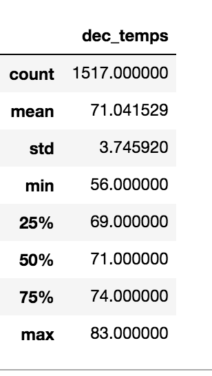
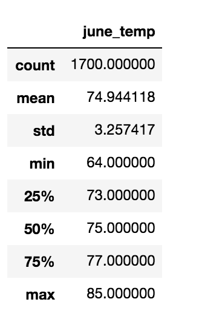

# surfs_up

## Overview of Statistical Analysis:
      The purpose of the statisrtical analysis is to explore the temperature data in the months of
      June and December in Oahu will sustain a year-round ice cream shop and surfing business.
      
      
      
      
      
## Results:
      The three key different in weather between June and December are listed below:
         . The total count between June and December are different. December has 1517 total 
           count while June has 1700 count.
         . The temperature main is higher in the month of June, at 74.944118 which is expected
           as June is in the summer months. The December main temperature compare to June is lower 
           by 4 degrees, at 71.041529 as it is the rainning seasons.
         . Both June and December temperatures fluctuated. The difference is that in June, the 
           temperatures fluctuated from 75 to 85 degrees while in December, temperatures fluctuated 
           from 71 to 83 degrees.
           
                              

              
## Summary:
      comparing the statistical summaries, the average temperature do not indicate the time when the 
      temperature were taken. If the temperature was taken in the morning, it could change from 10 - 20 
      degrees in the afretnoon. The lowerest tmeperature recorded in December was 56 degrees, which might 
      have been cool for the local population, but some tourists will find it perfect for vactioning and 
      ice cream. I would recommand running statistical analysis for a few more months, and see if the outcome 
      correlate with the temperature averages against the number of tourists visiting Oahu at the time. 
      
      

